<p align="center">
  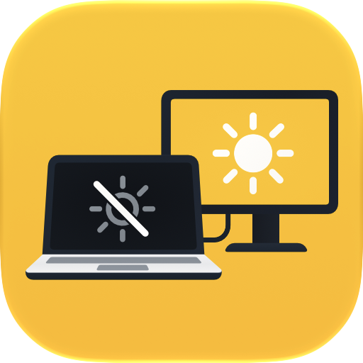
</p>

<h1 align="center">Lidless</h1>

<p align="center">
  <b>Keep the lid open. Turn the screen off.</b><br>
  A free, open-source menu bar app for MacBooks that live on a desk.
</p>

<p align="center">
  <a href="https://github.com/MRXGAMER999/Lidless/releases/latest"></a>
  
  
  <a href="LICENSE"></a>
  <a href="https://github.com/MRXGAMER999/Lidless/actions/workflows/ci.yml"></a>
</p>

<p align="center">
  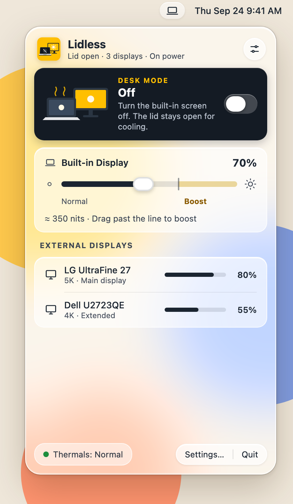
  &nbsp;
  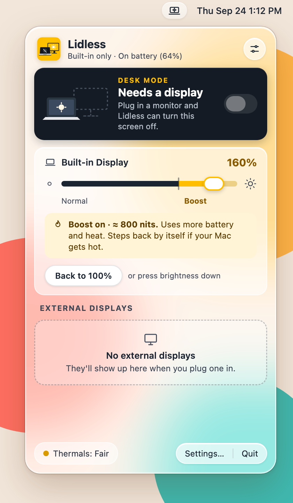
  &nbsp;
  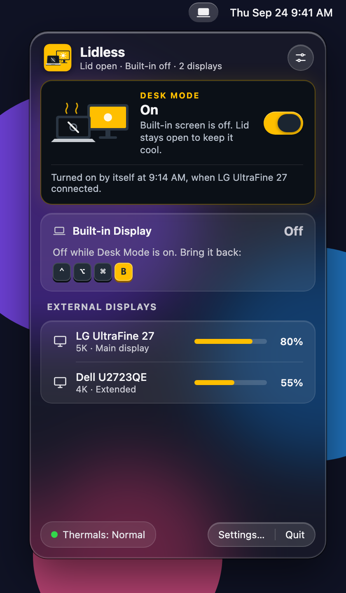
</p>

Lidless is a small alternative to BetterDisplay for the things a MacBook on a desk actually needs:

- **Desk Mode** turns the built-in screen off while the lid stays open, so the Mac runs cooler next to an external display. Windows move to your other screen.
- **Brightness Boost** makes the XDR screen brighter than 100% using its HDR headroom, up to the panel's sustained limit (about 1,000 nits).
- **External brightness** sets your monitors' brightness over DDC, or dims them in software when DDC isn't available (for example over HDMI).
- **A safety net** that always brings the built-in screen back: when displays are unplugged, after a crash, with a panic key, or when you don't confirm a change.

## Download

1. Get **Lidless-x.y.z.dmg** (or the .zip) from the [latest release](https://github.com/MRXGAMER999/Lidless/releases/latest).
2. Drag **Lidless** into **Applications**.
3. Open it. Lidless isn't notarized (it's signed ad hoc, without a paid developer account), so macOS blocks the first launch. Go to **System Settings › Privacy & Security** and click **Open Anyway**. On macOS 14 and earlier, you can also right-click the app and choose **Open**.

**Requirements:** a Mac with Apple silicon and macOS 12 Monterey or later. Brightness Boost needs a MacBook Pro with a Liquid Retina XDR display. Desk Mode needs at least one external display.

## Desk Mode

<p align="center">
  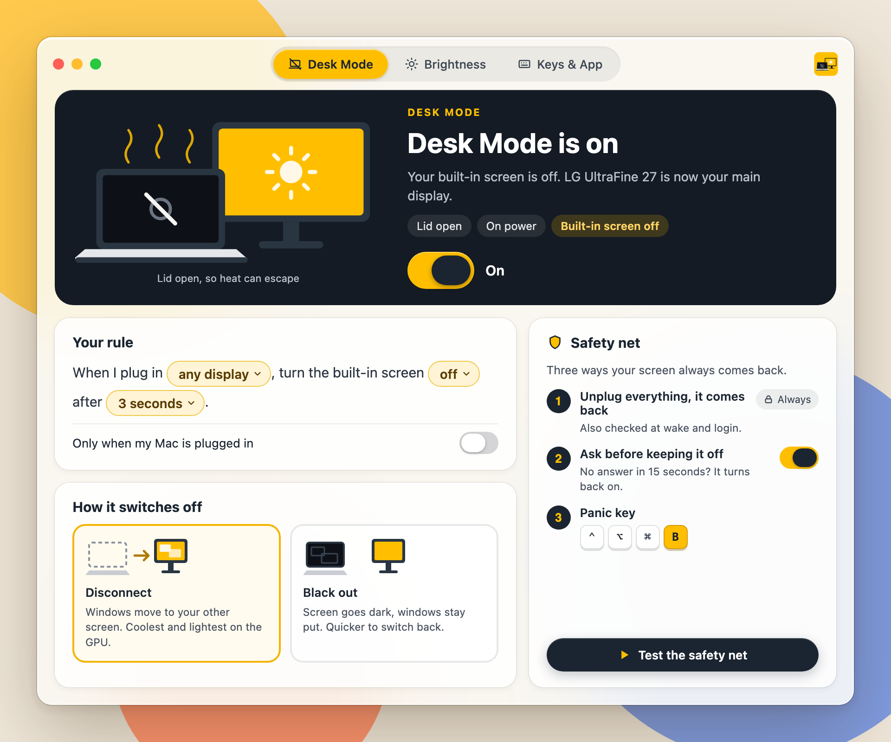
</p>

Turn it on from the popover, with <kbd>⌃</kbd><kbd>⌥</kbd><kbd>⌘</kbd><kbd>D</kbd>, from Shortcuts, or let a rule do it: *"When I plug in any display, turn the built-in screen off after 3 seconds."*

Choose how the screen switches off:

- **Disconnect** turns the panel off, so windows move to your other screen. It's the coolest option and the lightest on the GPU.
- **Black out** covers the screen in black and leaves your windows where they are. It's quicker to switch back.

### The safety net

Turning off the only screen you can see is scary, so Lidless always has a way back:

1. **Unplug everything and it comes back.** If the last external display goes away, the built-in screen turns on within about a second. This is also checked at wake and at login.
2. **Ask before keeping it off.** After Desk Mode turns on, a prompt appears on your external display. If nobody answers within 15 seconds, the screen comes back.
3. **The panic key.** Press <kbd>⌃</kbd><kbd>⌥</kbd><kbd>⌘</kbd><kbd>B</kbd> at any time to bring the screen back and end Boost and dimming.

Behind the scenes, a small watchdog process turns the built-in screen back on if Lidless crashes or hangs.

<p align="center">
  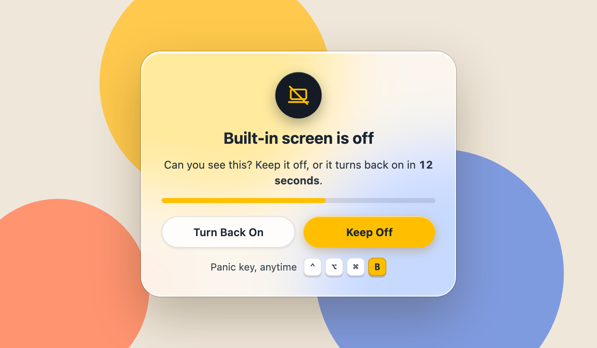
</p>

## Brightness Boost

<p align="center">
  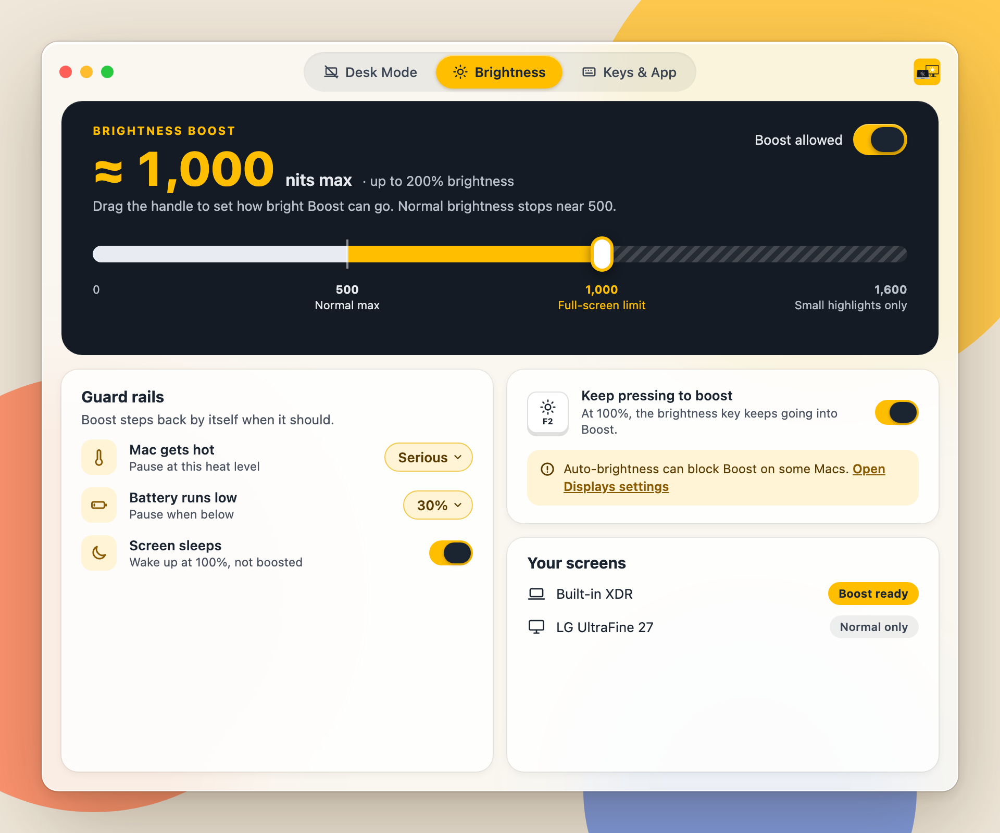
</p>

Drag the built-in slider past the line, press <kbd>⌃</kbd><kbd>⌥</kbd><kbd>⌘</kbd><kbd>=</kbd>, or keep pressing the brightness-up key at 100%. Lidless uses the screen's EDR headroom, the same technique macOS uses for HDR video, and never touches gamma tables.

The **guard rails** pause Boost when the Mac gets hot or the battery runs low, and can return the screen to 100% after sleep. You choose the ceiling.

## Keys, Shortcuts and the menu bar

<p align="center">
  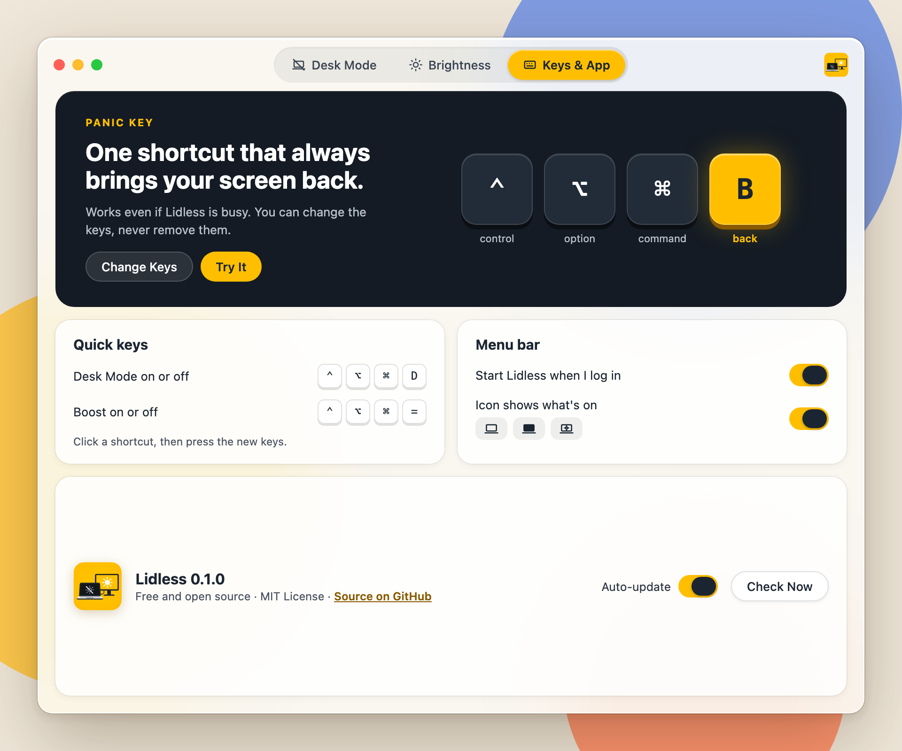
</p>

| Action | Default key |
|---|---|
| Bring the screen back (panic key) | <kbd>⌃</kbd><kbd>⌥</kbd><kbd>⌘</kbd><kbd>B</kbd> |
| Toggle Desk Mode | <kbd>⌃</kbd><kbd>⌥</kbd><kbd>⌘</kbd><kbd>D</kbd> |
| Toggle Brightness Boost | <kbd>⌃</kbd><kbd>⌥</kbd><kbd>⌘</kbd><kbd>=</kbd> |

Every key can be changed in Settings. The global keys use Carbon hot keys, so they don't need Accessibility access. Only "keep pressing to boost" asks for Input Monitoring, and only if you turn it on.

On macOS 13 and later, Lidless adds actions to **Shortcuts** and Siri: *Turn Desk Mode On*, *Turn Desk Mode Off*, *Toggle Desk Mode*, *Turn the Built-in Display Back On*, *Get Desk Mode State* and *Set Brightness Boost*.

The menu bar icon shows what's on:

<p align="center">
  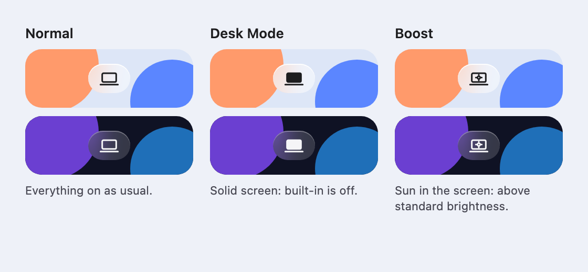
</p>

<details>
<summary><b>First run and notifications</b></summary>
<br>
<p align="center">
  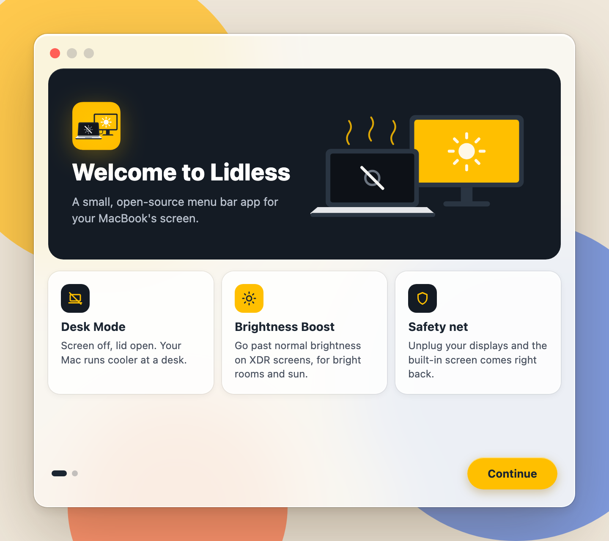
  &nbsp;
  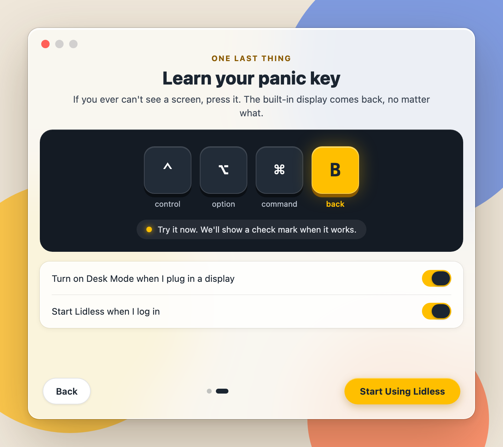
</p>
<p align="center">
  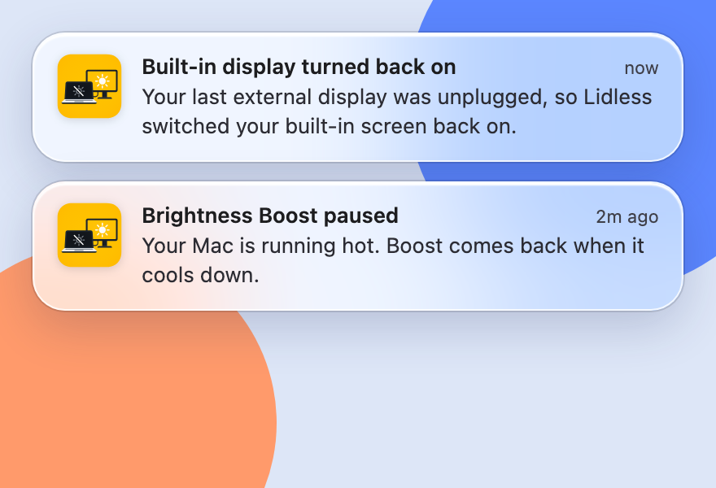
</p>
</details>

## Good to know

- **Other display apps.** BetterDisplay, Lunar, SoloDisplay, BrightIntosh, Vivid, MonitorControl and DisplayBuddy control the same things. Lidless tells you when one of them is running alongside a feature it can fight with.
- **Private APIs.** macOS has no public API for turning off the built-in screen, so Desk Mode uses the same private WindowServer call as other display utilities. A future macOS update could break it; the safety net is there for that case.
- **External display flicker.** When Desk Mode switches, macOS applies a saved display arrangement, and that can make an HDMI monitor resync for a second. If it happens every time, give your monitor the same resolution and color settings with and without the built-in screen.
- **No auto-updates yet.** *Check for Updates* opens the latest release on GitHub.

## Build from source

1. Install Xcode 27 or later.
2. Open `Lidless/Lidless.xcodeproj`.
3. Choose the **Lidless** scheme and press <kbd>⌘</kbd><kbd>R</kbd>.

Run the tests with <kbd>⌘</kbd><kbd>U</kbd>. From the command line:

```bash
xcodebuild test -project Lidless/Lidless.xcodeproj -scheme LidlessCore
```

The `LidlessCore` framework holds the pure logic (the Desk Mode state machine, the watchdog policy, Boost math) and its tests run without launching the app. Set `LIDLESS_SAFE_MODE=1` to start the app without any UI.

### Releasing

Releases are signed ad hoc (no Developer ID, no notarization), arm64 only, for macOS 12 and later.

1. Bump `MARKETING_VERSION` (and `CURRENT_PROJECT_VERSION`) for the Lidless target. Optionally write `.github/release-notes/vX.Y.Z.md`.
2. Do a local dry run with `scripts/release.sh X.Y.Z`. It archives Release into `dist/`; checks the version, the signature and macOS 12 compatibility (`scripts/check-availability.sh`); and writes the zip, the DMG and `SHA256SUMS`.
3. Tag and push: `git tag vX.Y.Z && git push origin vX.Y.Z`. The Release workflow builds the same files on GitHub and publishes the release.

## License

The source code is released under the [MIT License](LICENSE).

The app icon artwork (`Lidless/Lidless/AppIcon.icon`, `Lidless/Lidless/Assets.xcassets/AppIconArt.imageset` and `docs/images/icon.png`) is **not** covered by the MIT License. It was made with Arrow by QuiverAI on its free tier, which allows personal, non-commercial use only. If you fork Lidless for anything else, replace the icon with your own.

The screenshots come from Lidless's design mock-ups, so the display names in them are examples.
